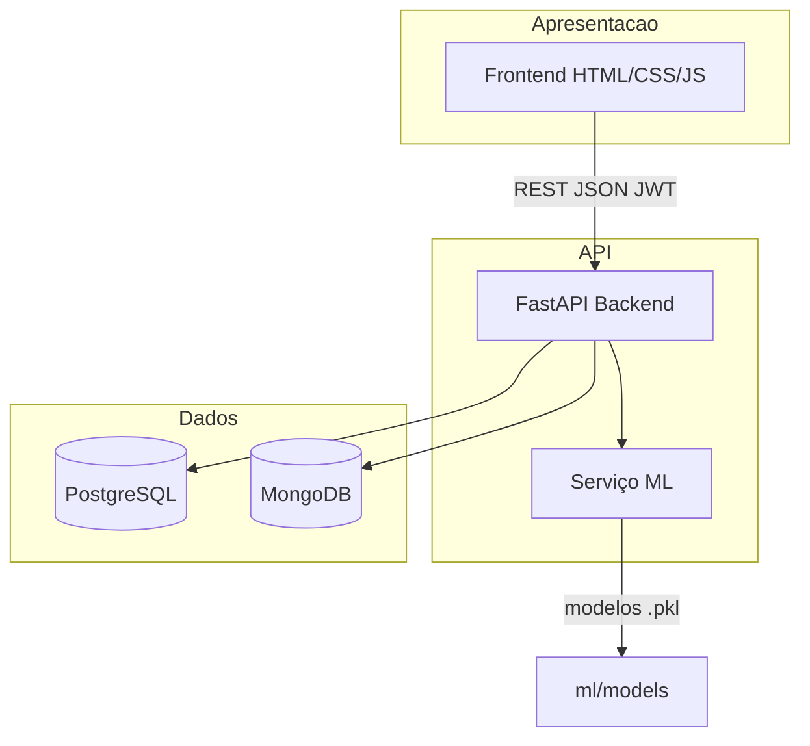

# Arquitetura do Sistema

## Visão Geral

Sistema web em camadas para clínicas populares (SUS), integrando prontuário eletrônico, agendamento e fila inteligente com predições de Machine Learning.

## Camadas

| Camada | Tecnologia | Responsabilidade |
|--------|------------|------------------|
| Apresentação | HTML5, CSS3, JavaScript | Login, Fila, Painel Médico, Cadastro |
| API | FastAPI, Pydantic | Regras de negócio, autenticação, orquestração |
| Persistência SQL | PostgreSQL, SQLAlchemy | Dados transacionais (pacientes, fila, etc.) |
| Persistência NoSQL | MongoDB, Motor | Logs de auditoria, histórico para ML |
| ML | Python, Pandas, Scikit-learn | Predição espera e no-show |
| Infra | Docker Compose | Ambiente reproduzível |

## Segurança

- **Autenticação:** JWT (access token 8h)
- **Autorização:** RBAC — `admin`, `medico`, `recepcao`
- **Senhas:** bcrypt
- **CORS:** configurável por ambiente
- **LGPD:** logs sem dados clínicos completos; CPF mascarado em telas públicas da fila

## Qualidade de Software

- Separação routers / services / schemas
- Testes pytest na API
- Variáveis de ambiente (.env)
- Migrations via SQL inicial (schema.sql)

## Experiência do Usuário

- Design limpo voltado a clínicas populares (alto contraste, fontes legíveis)
- Fila com atualização automática a cada 15s
- Badges de prioridade (idoso, gestante, PCD)
- Alertas visuais de risco de falta no agendamento

## Fluxo Principal

1. Recepção cadastra paciente
2. Agenda consulta → ML calcula prob. no-show
3. Paciente chega → entra na fila → ML estima tempo
4. Recepção chama próximo (prioridade)
5. Médico atende e registra prontuário
6. Sistema grava log no MongoDB
