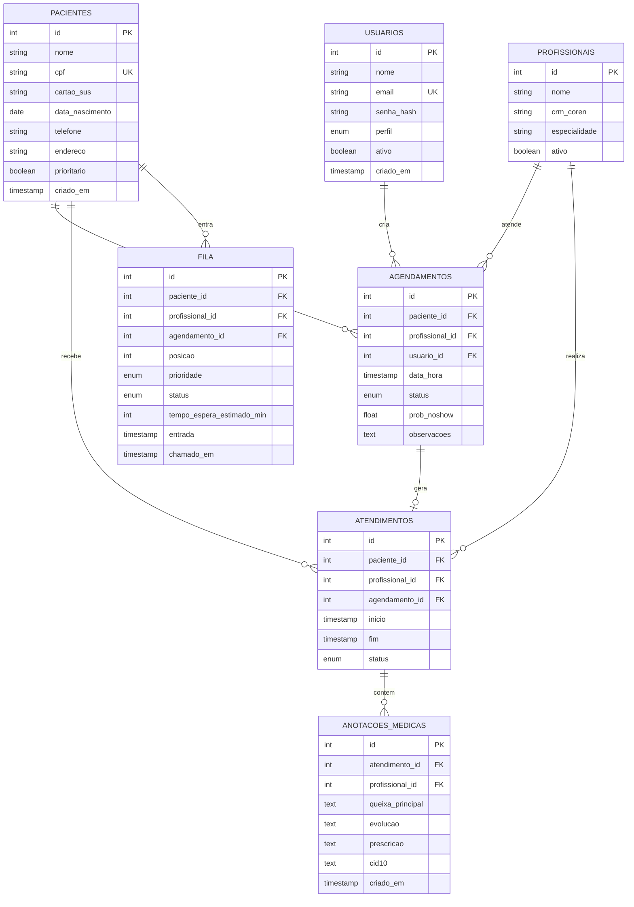

# Diagrama Entidade-Relacionamento

## Modelo Conceitual



## Cardinalidades

| Relacionamento | Cardinalidade | Regra |
|----------------|---------------|-------|
| Paciente → Agendamento | 1:N | Um paciente pode ter vários agendamentos |
| Profissional → Agendamento | 1:N | Um profissional atende vários pacientes |
| Agendamento → Atendimento | 1:0..1 | Nem todo agendamento vira atendimento (falta) |
| Atendimento → Anotação | 1:N | Várias notas por atendimento (evoluções) |
| Paciente → Fila | 1:N | Histórico de passagens na fila |

## NoSQL (MongoDB) — Logs e Histórico

Coleção `audit_logs` (documentos flexíveis):

```json
{
  "_id": "ObjectId",
  "usuario_id": 1,
  "acao": "CREATE_PACIENTE",
  "entidade": "pacientes",
  "entidade_id": 42,
  "payload_resumo": { "nome": "Maria S." },
  "ip": "192.168.1.10",
  "timestamp": "2026-05-17T14:30:00Z"
}
```

Coleção `historico_fila` — snapshots para análise ML:

```json
{
  "fila_id": 15,
  "paciente_id": 8,
  "prioridade": "idoso",
  "tempo_espera_real_min": 47,
  "dia_semana": 1,
  "hora_entrada": 9,
  "profissional_especialidade": "Clínico Geral"
}
```
