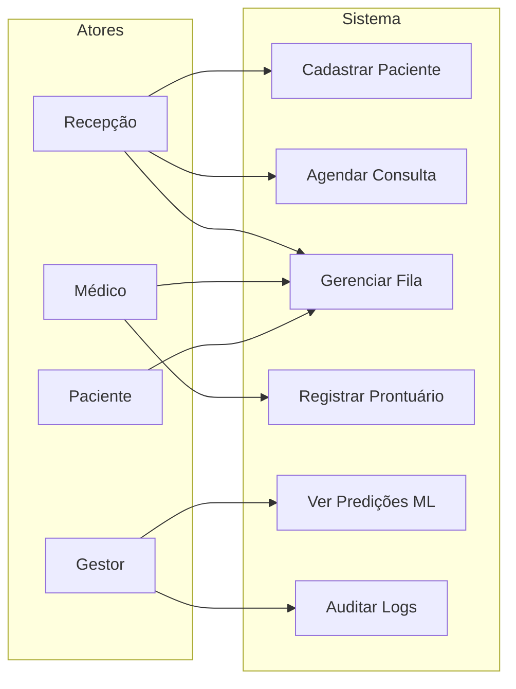

# Engenharia de Software — Clínica Popular PEP

**Tema:** Sistema ágil de prontuário eletrônico e fila inteligente para clínicas populares

---

## 1. Requisitos

### 1.1 Requisitos Funcionais (RF)

| ID | Requisito | Prioridade |
|----|-----------|------------|
| RF01 | Cadastrar pacientes (nome, CPF, SUS, contato, endereço) | Alta |
| RF02 | Registrar histórico de consultas e anotações médicas | Alta |
| RF03 | Agendar consultas com validação de conflito de horário | Alta |
| RF04 | Gerenciar fila de atendimento com prioridades | Alta |
| RF05 | Exibir tempo estimado de espera (ML) | Alta |
| RF06 | Prever probabilidade de falta (no-show) | Média |
| RF07 | Autenticar usuários por perfil (admin, médico, recepção) | Alta |
| RF08 | Painel médico para evolução clínica | Alta |
| RF09 | Registrar logs de auditoria (NoSQL) | Média |
| RF10 | Dashboard de indicadores da clínica | Média |

### 1.2 Requisitos Não Funcionais (RNF)

| ID | Requisito |
|----|-----------|
| RNF01 | Resposta da API < 500ms em operações comuns |
| RNF02 | Senhas com hash bcrypt; JWT para sessões |
| RNF03 | Interface responsiva e acessível (WCAG básico) |
| RNF04 | Dados sensíveis conforme LGPD (mínimo necessário) |
| RNF05 | Disponibilidade 99% em horário de expediente |
| RNF06 | Backup diário do PostgreSQL |

---

## 2. User Stories

### Épico: Prontuário Eletrônico

- **US01** — Como recepcionista, quero cadastrar pacientes para que tenham prontuário digital.
- **US02** — Como médico, quero registrar anotações clínicas para manter histórico completo.
- **US03** — Como médico, quero consultar histórico de atendimentos anteriores.

### Épico: Agendamento

- **US04** — Como recepcionista, quero marcar consultas evitando conflitos de horário.
- **US05** — Como recepcionista, quero visualizar agenda do profissional por dia.
- **US06** — Como sistema, devo alertar quando paciente tem alto risco de falta.

### Épico: Fila Inteligente

- **US07** — Como paciente na recepção, quero ver minha posição e tempo estimado na fila.
- **US08** — Como recepcionista, quero chamar próximo da fila respeitando prioridades.
- **US09** — Como gestor, quero analisar tempo médio de espera por especialidade.

### Épico: Segurança e Acesso

- **US10** — Como usuário, quero fazer login seguro com meu perfil de acesso.
- **US11** — Como auditor, quero consultar logs de ações no sistema.

---

## 3. Backlog do Produto

| # | Item | Story | Sprint | Status |
|---|------|-------|--------|--------|
| 1 | Modelagem ER e schema SQL | — | 1 | Concluído |
| 2 | API de autenticação JWT | US10 | 1 | Concluído |
| 3 | CRUD pacientes | US01 | 1 | Concluído |
| 4 | CRUD agendamentos + anti-conflito | US04, US05 | 2 | Concluído |
| 5 | Fila com prioridades | US07, US08 | 2 | Concluído |
| 6 | Prontuário e anotações | US02, US03 | 2 | Concluído |
| 7 | Modelo ML tempo de espera | US07, US09 | 3 | Concluído |
| 8 | Modelo ML no-show | US06 | 3 | Concluído |
| 9 | Logs NoSQL (MongoDB) | US11 | 3 | Concluído |
| 10 | Telas: Login, Fila, Painel, Cadastro | Todas | 3 | Concluído |
| 11 | Testes automatizados API | — | 3 | Concluído |
| 12 | Docker Compose ambiente completo | — | 3 | Concluído |

---

## 4. Sprints (Metodologia Ágil — Scrum)

### Sprint 1 — Fundação (2 semanas)
**Objetivo:** Banco de dados e autenticação operacionais.

- Diagrama ER e scripts SQL
- Docker PostgreSQL + MongoDB
- API FastAPI com login JWT
- Cadastro básico de pacientes

**Definition of Done:** Schema aplicado; login retorna token; paciente criado via API.

### Sprint 2 — Operação Clínica (2 semanas)
**Objetivo:** Fluxo diário da clínica.

- Agendamento com validação de conflitos
- Fila inteligente (prioridade: idoso, gestante, PCD, normal)
- Atendimentos e anotações médicas
- Telas frontend principais

**Definition of Done:** Recepção agenda, coloca na fila e médico registra evolução.

### Sprint 3 — Inteligência e Qualidade (2 semanas)
**Objetivo:** ML, logs e testes.

- Treinamento modelos (espera + no-show)
- Integração predições na API
- Logs de auditoria no MongoDB
- Testes pytest; documentação final

**Definition of Done:** Predições na fila; logs gravados; testes passando.

---

## 5. Plano de Testes

### 5.1 Testes Unitários
- Validação de CPF
- Cálculo de prioridade na fila
- Hash de senha e geração JWT

### 5.2 Testes de Integração (API)
- `POST /auth/login` — credenciais válidas/inválidas
- `POST /pacientes` — criação e duplicidade CPF
- `POST /agendamentos` — conflito de horário rejeitado
- `POST /fila/entrar` — posição e tempo estimado
- `GET /fila` — ordenação por prioridade

### 5.3 Testes de ML
- Modelo de espera retorna valor >= 0
- Modelo no-show retorna probabilidade entre 0 e 1
- Métricas: MAE (espera), AUC-ROC (no-show)

### 5.4 Testes de Interface (manual)
| Tela | Cenário | Resultado esperado |
|------|---------|-------------------|
| Login | Credenciais corretas | Redireciona para dashboard |
| Cadastro | Novo paciente | Mensagem de sucesso |
| Fila | Atualização automática | Posição e tempo atualizados |
| Painel médico | Salvar evolução | Anotação persistida |

### 5.5 Testes de Segurança
- Rotas protegidas sem token → 401
- Perfil recepção não acessa rotas só-médico → 403
- SQL injection mitigado (ORM/parametrizado)

---

## 6. Diagrama de Casos de Uso (resumo)

